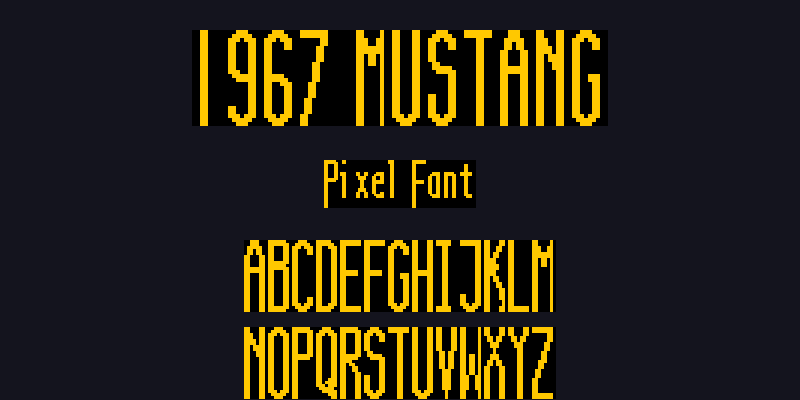

# 67-mustang-pixel-font

Hand-crafted 7×24 pixel bitmap font inspired by the instrument panel of the 1967 Mustang.



This font is a pixel font for use with the Adafruit GFX and other libraries used with Microcontrollers. It was inspired by the font used for the numbers on the instrument panel of 1960's Fords, notably the 1967 Mustang.

## Overview

`custom_font.h` is a complete, production-ready 1-bit bitmap font designed for use with the **Adafruit GFX** library on AVR microcontrollers (e.g., Arduino with SSD1306 OLED displays). All glyphs are stored in `PROGMEM` to minimize RAM usage.

## Features

- **24 pixels tall** — All glyphs share a consistent height
- **Variable width** — Optimized glyph widths for readability:
  - Narrow characters (I, i, l, space, apostrophe, pipe, backtick): 3–5px
  - Standard characters: 6–7px
  - Wide characters (M, W, m, w, #, @, 4): 8px
- **Complete character set**:
  - Digits: `0–9`
  - Uppercase letters: `A–Z`
  - Lowercase letters: `a–z` (with proper ascenders and descenders)
  - Punctuation & symbols: `! " # $ % & ' ( ) * + , - . / : ; < = > ? @ [ \ ] ^ _ \` { | } ~`
- **PROGMEM storage** — Optimized for low-memory AVR targets
- **MSB-first bitmap encoding** — Compatible with `display.drawBitmap()`

## Quick Start

### Include the Font

```cpp
#include "custom_font.h"
```

### Initialize Your Display

```cpp
#include <Wire.h>
#include <Adafruit_GFX.h>
#include <Adafruit_SSD1306.h>

#define SCREEN_WIDTH 128
#define SCREEN_HEIGHT 64
#define OLED_RESET -1

Adafruit_SSD1306 display(SCREEN_WIDTH, SCREEN_HEIGHT, &Wire, OLED_RESET);

void setup() {
  display.begin(SSD1306_SWITCHCAPVCC, 0x3C);
  display.clearDisplay();
}
```

### Draw Text

```cpp
// Draw a string at position (x, y)
drawString(display, 10, 20, "Hello!", SSD1306_WHITE, true);
display.display();

// Calculate string width for centering
const char* text = "Mustang";
uint16_t w = stringWidth(text, true);
int16_t x = (SCREEN_WIDTH - w) / 2;
drawString(display, x, 20, text, SSD1306_WHITE, true);
display.display();
```

### Case Sensitivity

Set `trueCase` parameter to `true` for proper uppercase/lowercase rendering:

```cpp
drawString(display, 0, 0, "Hello World", SSD1306_WHITE, true);  // Renders "H" as uppercase, "ello" as lowercase
drawString(display, 0, 0, "HELLO WORLD", SSD1306_WHITE, false); // All uppercase (backward compatible)
```

## API Reference

### `getGlyph(char c, bool trueCase = false)`

Returns a pointer to the `Glyph` structure for character `c`.

- **Parameters:**
  - `c` — Character to look up
  - `trueCase` — If `true`, lowercase letters render with lowercase glyphs; if `false`, lowercase letters render as uppercase (default: `false`)
- **Returns:** `const Glyph*` or `nullptr` if the character is unsupported

### `drawString(DisplayType& display, int16_t x, int16_t y, const char* str, uint16_t color, bool trueCase = false)`

Draws a null-terminated string on the display.

- **Parameters:**
  - `display` — Adafruit GFX-compatible display object (e.g., `Adafruit_SSD1306`)
  - `x`, `y` — Top-left corner of the string
  - `str` — Null-terminated C string to draw
  - `color` — Pixel color (e.g., `SSD1306_WHITE`, `SSD1306_BLACK`)
  - `trueCase` — If `true`, respects uppercase/lowercase; if `false`, all letters render as uppercase (default: `false`)

### `stringWidth(const char* str, bool trueCase = false)`

Calculates the pixel width of a string (useful for centering).

- **Parameters:**
  - `str` — Null-terminated C string
  - `trueCase` — If `true`, respects uppercase/lowercase widths; if `false`, assumes uppercase (default: `false`)
- **Returns:** `uint16_t` — Total pixel width of the string (includes 1px spacing between glyphs)

## Glyph Width Reference

| Character(s) | Width (px) |
|-------------|------------|
| I | 5 |
| M, W | 8 |
| 4, #, @, m, w | 8 |
| 1 | 6 |
| i, j, l | 4 |
| space, ', \|, ` | 3 |
| " | 5 |
| ( ) | 5 |
| All other uppercase letters | 7 |
| All other lowercase letters | 6 |
| All other digits | 7 |
| Most punctuation/symbols | 7 |

## Example Sketch

See `examples/demo/demo.ino` for a complete working example that demonstrates:
- Initializing a 128×64 SSD1306 display
- Drawing centered text
- Using both uppercase and lowercase glyphs
- Displaying digits and punctuation

## Technical Details

### Bitmap Format

- **Encoding:** MSB-first (leftmost pixel = bit 7)
- **Packing:** One byte per row for glyphs ≤8px wide
- **Alignment:** Left-aligned within each byte (unused low bits are zero)

### Memory Usage

Each glyph consumes:
- **24 bytes** — Bitmap data (1 byte × 24 rows)
- **3 bytes** — Glyph structure overhead (pointer + width byte)

Total font size in PROGMEM: **~9 KB**

### Compatibility

- **Microcontrollers:** AVR (Arduino Uno, Nano, Mega), ESP8266, ESP32
- **Display libraries:** Adafruit GFX, U8g2 (with adapter), or any library supporting `drawBitmap()`
- **Compiler:** Tested with Arduino IDE 1.8+ and PlatformIO

## License

This font is provided as-is for educational and hobby projects. Feel free to modify and distribute.

## Credits

Inspired by the iconic instrument panel typography of the 1967 Ford Mustang.
